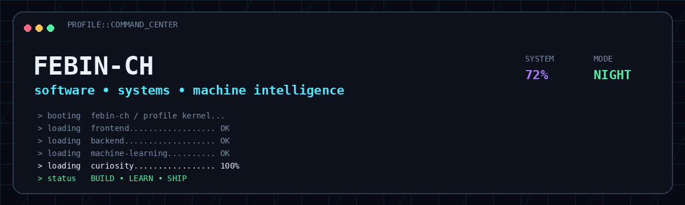
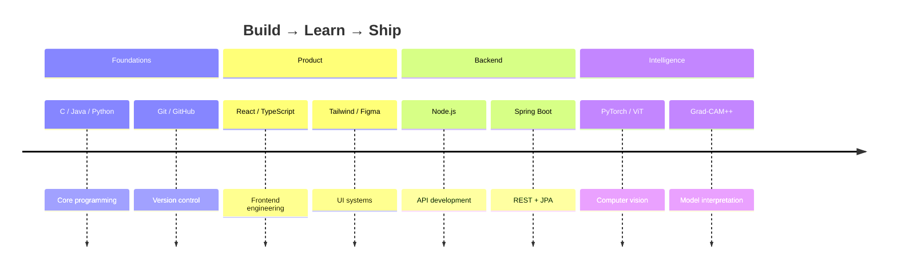

<div align="center">

# `FEBIN-CH`

### SOFTWARE DEVELOPER • FRONT-END ENGINEER • ML EXPLORER

<p>
  <a href="https://github.com/febin-ch"></a>
  <a href="https://www.instagram.com/febinch"></a>
</p>

> **Building interfaces that feel good. Engineering systems that hold up. Exploring intelligence that matters.**

</div>

<p align="center">
  
</p>

<p align="center">
  
</p>

---

## `01 / CURRENT STATE`

<table>
<tr>
<td width="55%" valign="top">

### Hello, I'm Febin 👋

I'm a **Computer Science Engineer** who enjoys moving between the visual side of software and the engineering underneath it.

I like working across:

- **Frontend** → React, TypeScript, Tailwind CSS
- **Backend** → Node.js, Spring Boot, REST APIs
- **Data / AI** → Python, PyTorch, Vision Transformers
- **Product thinking** → UI/UX, developer experience, useful automation

Currently exploring how to turn small ideas into polished, usable systems.

</td>
<td width="45%" valign="top">

### `SYSTEM PROFILE`

```text
ROLE       Software Developer
FOCUS      Web • AI/ML • Product
STACK      React + TS + Node + Python
CURRENT    Learning / Building / Shipping
OS         Curiosity
MODE       Always iterating
```

</td>
</tr>
</table>

---

## `02 / STACK`

### Languages


### Frontend


### Backend / Data / AI


### Workflow


---

## `03 / FEATURED BUILDS`

<table>
<tr>
<td width="50%" valign="top">

### 🛰️ LocoWorks
**Local Service Hiring Platform**

A location-aware service discovery platform with authentication, radius-based search, ratings and a practical user flow.

`React` `Node.js` `Firebase` `Leaflet`

<a href="https://github.com/febin-ch/LocoWorks">

</a>

</td>
<td width="50%" valign="top">

### 🚨 EARLY-WARNING
**Real-Time Alert Application**

A web-based early warning system designed around timely alerts for natural disasters, severe weather and emergencies.

`HTML` `CSS` `JavaScript` `Firebase`

<a href="https://github.com/febin-ch/EARLY-WARNING">

</a>

</td>
</tr>

<tr>
<td width="50%" valign="top">

### 🫁 LungCheck
**Vision Transformer Pneumonia Detection**

Experimenting with image classification, lung-focused visual explanations and Grad-CAM++ style interpretability.

`Python` `PyTorch` `ViT` `OpenCV` `Streamlit`

</td>
<td width="50%" valign="top">

### ☕ Spring Boot Student Manager
**RESTful Backend**

A structured backend project using REST APIs, Spring Data JPA and MySQL.

`Java` `Spring Boot` `JPA` `MySQL`

</td>
</tr>
</table>

---

## `04 / ENGINEERING TIMELINE`



---

## `05 / DEVELOPER TELEMETRY`

<div align="center">


<br/>


</div>

> **Note:** These cards are live services. If one ever becomes unavailable, the rest of the README still works.

---

## `06 / CONTRIBUTION MATRIX`

<div align="center">


</div>

---

## `07 / CURRENTLY EXPLORING`

```text
╭──────────────────────────────────────────────────────────────╮
│  [ FRONTEND ]  React + TypeScript + component architecture  │
│  [ BACKEND  ]  Node.js + Spring Boot + REST                │
│  [ AI / ML   ]  Vision Transformers + explainability      │
│  [ PRODUCT   ]  UI/UX + developer experience               │
│  [ FUTURE    ]  Distributed systems + intelligent tooling │
╰──────────────────────────────────────────────────────────────╯
```

---

## `08 / GITHUB REPOSITORY RADAR`

| Repository | What it represents |
|---|---|
| [`LocoWorks`](https://github.com/febin-ch/LocoWorks) | Full-stack product thinking |
| [`EARLY-WARNING`](https://github.com/febin-ch/EARLY-WARNING) | Real-world web application |
| [`Leetcode`](https://github.com/febin-ch/Leetcode) | Problem solving |
| [`HackerRank-Java`](https://github.com/febin-ch/HackerRank-Java) | Java practice |
| [`HackerRank-Python1`](https://github.com/febin-ch/HackerRank-Python1) | Python practice |
| [`Hacker-Rank-codes-C`](https://github.com/febin-ch/Hacker-Rank-codes-C) | C fundamentals |

---

## `09 / OPEN TERMINAL`

<details>
<summary><b>Run a tiny version of my developer mindset</b></summary>

```bash
$ whoami
febin-ch

$ cat mission.txt
Build useful things.
Make them feel polished.
Understand what happens underneath.
Keep learning.

$ echo $STATUS
BUILDING...

$ echo $NEXT
→ ship something better than yesterday
```

</details>

---

## `10 / SIGNALS`

<div align="center">


</div>

<p align="center">
  <b>“Surfing Through Everything Possible. Never Stopping it Enjoy!”</b>
</p>

<p align="center">
  <a href="https://github.com/febin-ch?tab=repositories">Explore repositories</a>
  •
  <a href="https://github.com/febin-ch">View profile</a>
  •
  <a href="https://www.instagram.com/febinch">Instagram</a>
</p>

---

<details>
<summary><b>🧩 CUSTOMIZATION PANEL — edit this README freely</b></summary>

### Easy things to change
- Replace the headline and intro.
- Add/remove skills and badges.
- Swap featured projects.
- Add your portfolio, LinkedIn, email or resume.
- Add your own quote, achievements and certifications.
- Replace the command-center GIF with your own animation.
- Add project screenshots using relative paths such as `./assets/project.png`.

### Optional power-ups
1. Add your own animated GIFs under `assets/`.
2. Add a `metrics` or `activity` section from a GitHub Action.
3. Add a generated `snake` contribution animation.
4. Add a personal domain and a portfolio CTA.
5. Add a “Now / Next / Later” roadmap.
6. Add project demo GIFs directly inside each project card.

</details>

<!--
===========================================================
CUSTOMIZATION ZONE
Everything below is intentionally easy to edit.

Useful placeholders you can add:
- Portfolio URL
- LinkedIn URL
- Email
- Resume URL
- Certifications
- Awards
- Internship / Experience
- Current role
- Personal projects
- Open source
- Research
- Favorite tools
===========================================================
-->

<!-- Snake animation example:

-->

<div align="center">

### `END OF TRANSMISSION`


</div>
