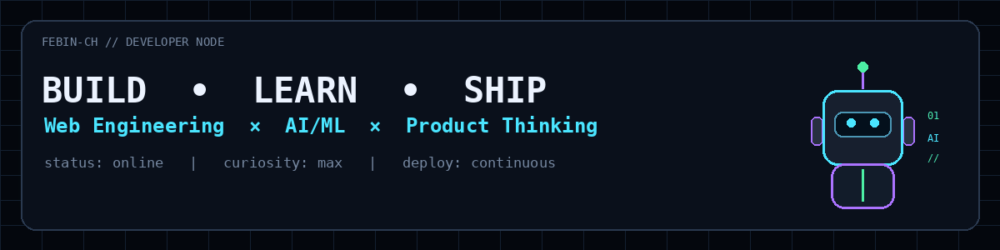
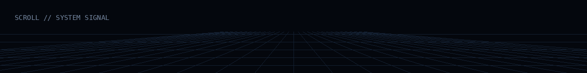
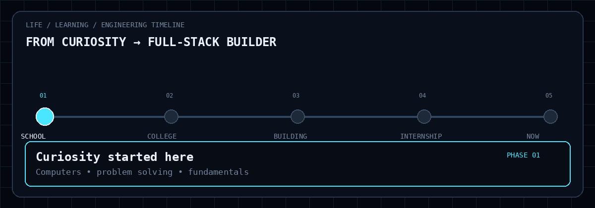
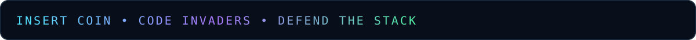
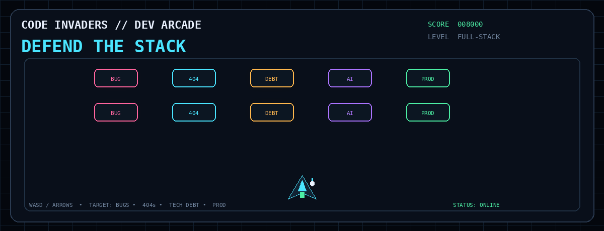

<div align="center">

# `FEBIN-CH`

### `FULL-STACK DEVELOPER` · `FRONTEND ENGINEER` · `AI/ML EXPLORER`



<p>
  <a href="https://github.com/febin-ch?tab=repositories"></a>
  <a href="https://www.instagram.com/febinch"></a>
</p>

> **I like turning ideas into interfaces, interfaces into systems, and systems into things people can actually use.**

</div>

---

## `01 / DEVELOPER IDENTITY`

<table>
<tr>
<td width="58%" valign="top">

### `HEY — I'M FEBIN.`

A **Computer Science Engineer** who likes the intersection where design, software engineering and intelligent systems meet.

I enjoy going from:

`IDEA` → `UI` → `API` → `DATA` → `DEPLOY`

My sweet spot is **full-stack development**, while still keeping one foot in **AI/ML** and **UI/UX**.

**What I build**
- ⚡ React + TypeScript interfaces
- 🔧 Node.js / Spring Boot backends
- 🗄️ REST APIs + MySQL / Firebase
- 🧠 PyTorch + Vision Transformers
- 🎨 Figma-driven product interfaces
- 🛰️ Practical tools with real-world use cases

</td>

<td width="42%" valign="top">

### `LIVE STATUS`

```text
┌───────────────────────────────┐
│ FEBIN://DEV-NODE              │
├───────────────────────────────┤
│ MODE        FULL-STACK        │
│ FRONTEND    React / TS        │
│ BACKEND     Node / Java       │
│ AI          PyTorch / ViT     │
│ DESIGN      Figma             │
│ STATE       BUILDING...       │
│ ENERGY      ██████████ 100%   │
└───────────────────────────────┘
```

</td>
</tr>
</table>

<p align="center">
  
</p>

---

## `02 / MY JOURNEY`

<p align="center">
  
</p>

### Expand any phase

<details>
<summary><b>01 · SCHOOL — Where the curiosity started</b></summary>

**Foundation phase**

This is where the interest in computers, problem solving and technology started.

**Add later:** your school name, favourite subjects, first programming experience, competitions, achievements, or the first moment you decided to pursue Computer Science.

</details>

<details>
<summary><b>02 · COLLEGE — Computer Science @ Amal Jyothi</b></summary>

**B.Tech in Computer Science Engineering**

This phase became the base for everything that followed: programming, web development, databases, AI/ML, computer networks, cloud concepts and software engineering.

**Already part of the story**
- CGPA: **8.72**
- React / Node.js / Java / Python
- AI/ML and computer vision projects
- IEEE Executive Committee involvement
- Hackathons, competitions and technical events

**Add later:** major milestones, favourite subjects, more awards, clubs, leadership moments, certificates, etc.

</details>

<details>
<summary><b>03 · BUILDING — Turning learning into projects</b></summary>

The “okay, let's actually build it” phase.

Projects include **LocoWorks**, **EARLY-WARNING**, **LungCheck**, a **Spring Boot Student Management System**, and problem-solving repositories for Java, Python and C.

This is where concepts became working software.

</details>

<details>
<summary><b>04 · INTERNSHIP — Software Developer Intern Trainee</b></summary>

Worked around **frontend development, backend systems and testing**, with hands-on work using **React, TypeScript and Tailwind CSS** and portal-oriented software.

Also worked on forms, validation, design-system style UI work and portal/ticketing related functionality.

**Add later:** exact dates, team, product name, strongest contributions, screenshots, technologies and measurable impact.

</details>

<details>
<summary><b>05 · NOW — Full-Stack Developer 🚀</b></summary>

Currently focused on becoming stronger across the full software stack:

`Frontend` → `Backend` → `APIs` → `Databases` → `AI/ML` → `Product`

The goal is simple: **build systems that look good, work well and make sense underneath.**

**Add later:** current company/team, current role, technologies, responsibilities, goals, certifications and future roadmap.

</details>

> 💡 **The GIF is the visual timeline. The expandable sections are your editable timeline data.**  
> Add more phases later without touching the animation.

---

## `03 / TECH STACK`

### Languages


### Frontend


### Backend / Data / AI


### Tools


---

## `04 / FEATURED BUILDS`

<table>
<tr>
<td width="50%" valign="top">

### 🛰️ LocoWorks
**Local Service Hiring Platform**

Location-aware service discovery with authentication, radius-based search and ratings.

`React` · `Node.js` · `Firebase` · `Leaflet`

<a href="https://github.com/febin-ch/LocoWorks"></a>

</td>

<td width="50%" valign="top">

### 🚨 EARLY-WARNING
**Real-Time Alert Application**

A web-based early-warning system for disaster, weather and emergency alerts.

`HTML` · `CSS` · `JavaScript` · `Firebase`

<a href="https://github.com/febin-ch/EARLY-WARNING"></a>

</td>
</tr>

<tr>
<td width="50%" valign="top">

### 🫁 LungCheck
**Vision Transformer Pneumonia Detection**

Computer-vision experimentation with ViT, lung-focused interpretation and Grad-CAM++.

`Python` · `PyTorch` · `ViT` · `OpenCV` · `Streamlit`

</td>

<td width="50%" valign="top">

### ☕ Spring Boot Student Manager
**RESTful Backend**

REST APIs with Spring Data JPA and MySQL.

`Java` · `Spring Boot` · `JPA` · `MySQL`

</td>
</tr>
</table>

---

## `05 / DEVELOPER TELEMETRY`

<div align="center">


<br/>


</div>

---

## `06 / CODE ARCADE`

<p align="center">
  
</p>

<p align="center">
  
</p>

<div align="center">

```text
┌──────────────────────────────────────────────────────────────┐
│  CODE INVADERS                                               │
│                                                              │
│  HOSTILES   BUG   404   DEBT   AI   PROD                    │
│                                                              │
│       ▾      ▾      ▾      ▾      ▾                          │
│                                                              │
│                         ▲                                    │
│                        /_\                                   │
│                                                              │
│  OBJECTIVE: DEFEND THE STACK                                │
│  SCORE:     KEEP SHIPPING                                   │
└──────────────────────────────────────────────────────────────┘
```

<details>
<summary><b>🎮 ARCADE RULES</b></summary>

**Enemy types**

`BUG` → kill it before it reaches production.  
`404` → locate the missing route.  
`DEBT` → refactor before it multiplies.  
`AI` → understand it before deploying it.  
`PROD` → the final boss.

The animation is intentionally self-contained in `assets/`, so it does not require GitHub Actions or a generated branch.

</details>

---

## `07 / CURRENTLY BUILDING`

```text
┌────────────────────────────────────────────────────────────────────┐
│ FRONTEND  → React + TypeScript + component architecture           │
│ BACKEND   → Node.js + Spring Boot + REST APIs                    │
│ DATABASE  → MySQL + Firebase                                    │
│ AI / ML   → PyTorch + Vision Transformers + explainability      │
│ PRODUCT   → UI/UX + developer experience                        │
│ NEXT      → stronger full-stack systems + intelligent tooling   │
└────────────────────────────────────────────────────────────────────┘
```

---

## `08 / REPOSITORY RADAR`

| Repository | Signal |
|---|---|
| [`LocoWorks`](https://github.com/febin-ch/LocoWorks) | Full-stack product thinking |
| [`EARLY-WARNING`](https://github.com/febin-ch/EARLY-WARNING) | Real-world web application |
| [`Leetcode`](https://github.com/febin-ch/Leetcode) | Problem solving |
| [`HackerRank-Java`](https://github.com/febin-ch/HackerRank-Java) | Java practice |
| [`HackerRank-Python1`](https://github.com/febin-ch/HackerRank-Python1) | Python practice |
| [`Hacker-Rank-codes-C`](https://github.com/febin-ch/Hacker-Rank-codes-C) | C fundamentals |

---

## `09 / TERMINAL`

<details>
<summary><b>▶ Open developer console</b></summary>

```bash
$ whoami
febin-ch

$ pwd
/ideas/projects/learning/building

$ cat philosophy.txt
Build things people can use.
Make the interface feel alive.
Understand the backend.
Keep learning.

$ systemctl status
● creativity        active
● curiosity         active
● shipping          active
● perfectionism     restarting...

$ echo $NEXT
ship > learn > improve > repeat
```

</details>

---

## `10 / SIGNAL`

<div align="center">


<p>
  <a href="https://github.com/febin-ch?tab=repositories">Repositories</a>
  •
  <a href="https://github.com/febin-ch">GitHub</a>
  •
  <a href="https://www.instagram.com/febinch">Instagram</a>
</p>

### `SURFING THROUGH EVERYTHING POSSIBLE. NEVER STOPPING IT ENJOY.`

</div>

---

<details>
<summary><b>🧩 CUSTOMIZATION PANEL</b></summary>

### Change later
- School name and school milestones
- College milestones and dates
- Internship / work dates and team details
- Current company / role
- Portfolio / LinkedIn / resume
- Certifications and awards
- More projects
- More skills
- Screenshots and demo GIFs

### Add a new timeline phase

1. Add one node to `assets/life-timeline.gif` by regenerating the GIF.
2. Add a matching `<details>` block under **MY JOURNEY**.
3. Add your description, technologies, achievements and links.
4. Keep the phase numbering consistent.

</details>

<div align="center">


</div>
